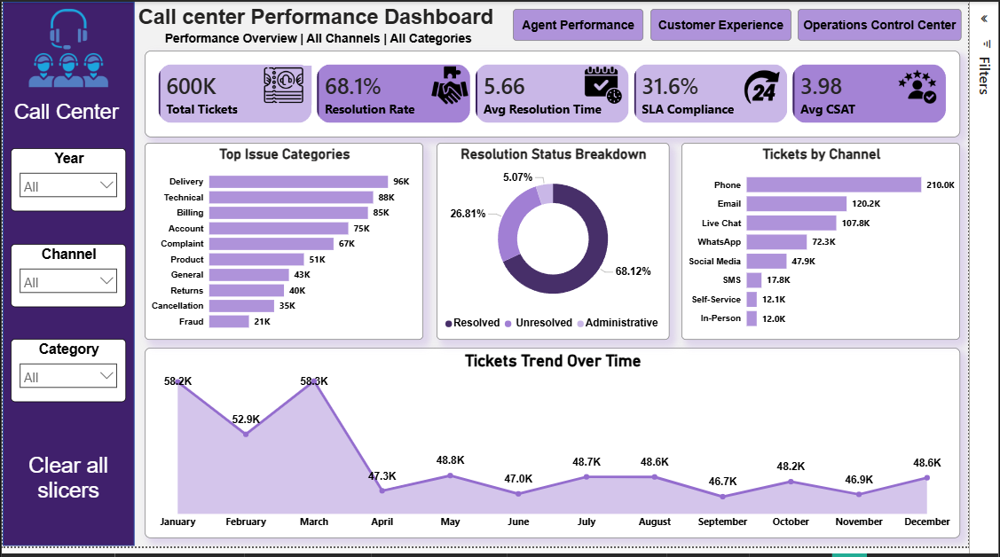
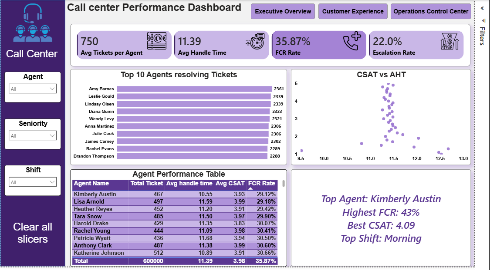
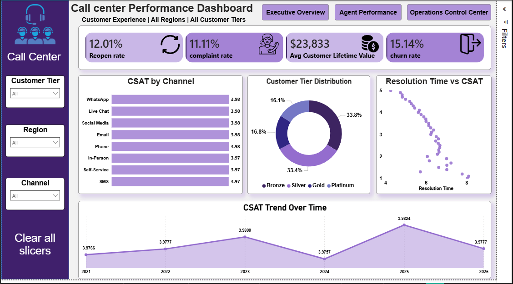

# 📞 Call Center Performance Dashboard

## 📌 Project Overview
An interactive Power BI dashboard designed to analyze and monitor call center operations using over 600,000 records.

The dashboard provides deep insights into:
- Operational efficiency
- Agent performance
- Customer experience
- Ticket resolution effectiveness
- SLA compliance
- Customer satisfaction trends

The project was built using a Star Schema data model with multiple dimension tables and advanced DAX measures to support business decision-making.

---

# 🎯 Business Objectives
- Monitor overall call center performance
- Analyze customer satisfaction and complaint trends
- Evaluate agent productivity and efficiency
- Track ticket resolution and escalation rates
- Identify operational bottlenecks
- Improve SLA compliance and response time

---

# 🛠️ Tools & Technologies
- Power BI
- Power Query
- DAX
- Data Modeling
- Data Visualization

---

# 🧩 Data Model
The project follows a Star Schema design.

## Fact Table
### fact_tickets
Contains transactional ticket-level data including:
- Ticket IDs
- Customers
- Agents
- Channels
- Resolution status
- CSAT score
- Resolution time
- Handle time
- Escalation status
- SLA metrics

## Dimension Tables
- dim_agent
- dim_customer
- dim_channel
- dim_issue_type
- dim_resolution
- dim_shift
- dim_team

---

# 📊 Dataset Information
- Over 600,000 records
- Multi-dimensional operational data
- Customer service interactions across multiple channels
- Historical performance tracking over multiple years

---

# 🧹 Data Preparation
Performed extensive data cleaning and transformation using Power Query:
- Handled missing values
- Corrected data types
- Standardized text fields
- Fixed date formats
- Created calculated columns
- Optimized data model relationships

---

# 📈 Key KPIs
The dashboard tracks multiple business KPIs including:

- Total Tickets
- Resolution Rate
- Avg Resolution Time
- SLA Compliance
- Avg CSAT
- Avg Handle Time
- FCR Rate
- Escalation Rate
- Complaint Rate
- Reopen Rate
- Churn Rate
- Avg Customer Lifetime Value
- Critical Ticket Rate
- Unresolved Tickets %

---

# 📂 Dashboard Pages

## 1️⃣ Executive Overview
Provides a high-level overview of:
- Total tickets
- Resolution performance
- SLA compliance
- Ticket trends over time
- Channel distribution
- Resolution status breakdown

---

## 2️⃣ Agent Performance
Analyzes:
- Top performing agents
- Avg handling time
- FCR performance
- Escalation metrics
- Agent CSAT scores
- Productivity comparison

---

## 3️⃣ Customer Experience
Focuses on:
- Customer satisfaction trends
- Complaint analysis
- Churn analysis
- Resolution time vs CSAT
- Customer tier distribution
- Channel satisfaction comparison

---

## 4️⃣ Operations Control Center
Monitors:
- Open tickets
- Workload distribution
- Critical ticket rates
- Shift performance
- Escalated ticket categories
- Operational pressure points

---

# 💡 Key Insights
- Phone channel generated the highest ticket volume.
- Higher resolution time negatively impacted CSAT scores.
- Morning shifts handled the largest operational workload.
- Escalation rates varied significantly across issue categories.
- SLA compliance opportunities were identified during peak periods.

---

# 🚀 Recommendations
- Increase staffing during peak operational hours.
- Improve resolution workflows for critical tickets.
- Optimize response time to improve customer satisfaction.
- Provide targeted training for lower-performing agents.
- Enhance SLA monitoring and escalation handling.

---

# 📸 Dashboard Preview

## Executive Overview

---

## Agent Performance

---

## Customer Experience

---

## Operations Control Center

---

# 📁 Project Files
- Power BI Dashboard (.pbix)
- Dashboard screenshots
- Data model structure
- DAX measures
- Power Query transformations
# 🔗 Power BI File
[Download Power BI Dashboard](https://drive.google.com/file/d/1VzHpcbyM_zkZYFsnzgaj2lLSTMZ1npN2/view?usp=sharing)

---

# 👤 Author
Ahmed Mohamed  
Data Analyst | Power BI | SQL | Python
